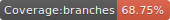

# express-supertest


[](https://github.com/facebook/jest)




<!-- description -->
[SuperTest](https://github.com/visionmedia/supertest) をやりたいが為に作ったプロジェクト。  
関係ないこともやってる。

## バッジ

[shields.io](https://shields.io/) で好きなバッジ作れる。  
カバレッジは [jest-coverage-badges](https://github.com/pamepeixinho/jest-coverage-badges) で出した。

## ロギング

### レベル

|Level|説明|
|:----|:---|
|fatal|即座に対応が必要なエラー。|
|error|ベストエフォートで対応が必要なエラー。|
|warn |すぐに問題になることはないが、後々対応が必要、もしくは今後 error になりそうな事象。|
|info |自分サーバ・プロセス外へのアクセスやサードパーティモジュールを利用する場合の入力情報などを出力。|
|debug|商用・本番では出力しないデバッグ用の情報。|
|trace|商用・本番では出力しない debug よりさらに詳細な情報。|

### レスポンスとログ出力

レスポンスベースで整理する。

|Level|errorCode|status|type                  |mesage|説明|
|:----|:--------|:-----|:---------------------|:-----|:---|
|fatal|FATAL001 |-     |Service Start Failure |      |アプリケーションサービスの起動に失敗。|
|error|ERROR001 |500   |Internal Server Error |      |ハンドリング不可能なエラーが発生。|
|error|ERROR002 |500   |Database Access Error |      |データベースアクセスでエラーが発生。|
|error|ERROR003 |500   |API Access Error      |      |APIアクセスでエラーが発生。|
|warn |WARN001  |400   |Bad Request           |      |リクエストに不正がある。|
|warn |WARN002  |401   |Unauthorized          |      |認証エラーが発生。|
|warn |WARN003  |403   |Forbidden             |      |権限の無いアクセス。|
|warn |WARN004  |404   |Not Found             |      |URIもしくは検索を依頼されたリソースが見つからない。サービスによっては空 body/200 statusで返却することを検討。|
|warn |WARN005  |405   |Method Not Allowed    |      |存在しない HTTP メソッドでのアクセス。許可が無い場合は 403/Forbidden で返却する。|
|warn |WARN006  |406   |Not Acceptable        |      |Accept-* ヘッダで準備のないものを依頼された場合。|
|warn |WARN007  |409   |Conflict              |      |依頼内容を実行するとリソース競合が発生するため拒否。|
|warn |WARN008  |415   |Unsupported Media Type|      |処理できない Content-Type で依頼された。|
|warn |WARN009  |422   |Unprocessable Entity  |      |入力値のバリデーションチェックでエラーが発生。400/Bad Request で返却するか悩む。|

レスポンスボディは以下。

```
{
  "errorCode": "xxxxx",
  "type": "xxxxx",
  "message": "xxxxx"
}
```

上記を加味して何をログ出力するかはこれから整理。（TODO）

### ロガー

ロガーは [winston](https://github.com/winstonjs/winston) 。  
リクエストロガーに [morgan](https://github.com/expressjs/morgan) とか [express-winston](https://github.com/bithavoc/express-winston) があるが、個人的に使いにくかったので使ってない。  
代わりに [on-headers](https://github.com/jshttp/on-headers) と [on-finished](https://github.com/jshttp/on-finished) を使って自分で実装。

### reqId の設定

[express-http-context](https://github.com/skonves/express-http-context) を利用して 1 リクエスト中に利用できる key-value に リクエスト ID ・トレース ID （ reqId ）を設定する。  
その値を logger が取得してログ出力時に reqId を付与する。  
reqId には uuidv4 を利用する。  
なお、[express-http-context](https://github.com/skonves/express-http-context) では スレッドローカルのように動作する **Continuation-local storage** が利用される。（厳密にはスレッドローカルではない。）  
詳しくは [cls-hooked](https://github.com/jeff-lewis/cls-hooked#readme) を参照 。

## JWT

[node-jsonwebtoken](https://github.com/auth0/node-jsonwebtoken) を利用してアクセストークンを実現した。  
鍵管理については参考にしないこと。

### 予約済みクレーム名

Payload で予約されたパラメータは以下。

|クレーム名|説明|nodeで使う時|
|---|---|---|
|iat|tokenが発行された時間|デフォルトで勝手に入る|
|exp|tokenの有効期限|expiresIn|
|iss|token発行者の名前|issuer|
|aud|どのクライアント向けに発行されたトークンであるかの識別子|audience|
|jti|トークンの固有 ID|jwtid|
|sub|ユーザーの識別子|subject|
|nbf|JWTが有効になる日時|notBefore|

- [参考](https://qiita.com/keitatata/items/fa89f007de21e286df17)

## バリデーション

### 入力チェック

HTTP リクエストのバリデーションは [express-validator](https://github.com/express-validator/express-validator) で実現。（TODO）

### JSON Schema

JSON Schema および Ajv を利用して JSON のバリデーションを実現した。

- [json-schema.org](https://json-schema.org/)
- [Ajv: Another JSON Schema Validator](https://github.com/epoberezkin/ajv)
    - Ajv version 6.0.0 that supports JSON Schema draft-07 is released.

## MongoDB

以下のように Docker でローカル実行できる。

```bash
$ docker pull mongo:3.6.13-xenial
$ docker run -d --name mongo -p 27017:27017 mongo:3.6.13-xenial
$ docker exec -it mongo bash
:/# mongo
>
```

### MongoDB 基礎

|MongoDB|RDB|
|:---|:---|
|データベース|データベース|
|コレクション|テーブル|
|ドキュメント|行 / レコード|
|フィールド|列 / カラム|

BSON（ Binary JSON ）のデータ型。（ [参考](https://docs.mongodb.com/manual/reference/operator/query/type/) ）

|Type|Number|Alias|Notes|
|:---|:---|:---|:---|
|Double|1|“double”||
|String|2|“string”||
|Object|3|“object”||
|Array|4|“array”||
|Binary data|5|“binData”||
|Undefined|6|“undefined”|Deprecated.|
|Object id|7|“objectId”||
|Boolean|8|“bool”||
|Date|9|“date”||
|Null|10|“null”||
|Regular Expression|11|“regex”||
|DBPointer|12|“dbPointer”|Deprecated.|
|JavaScript|13|“javascript”||
|Symbol|14|“symbol”|Deprecated.|
|JavaScript (with scope)|15|“javascriptWithScope”||
|32-bit integer|16|“int”||
|Timestamp|17|“timestamp”||
|64-bit integer|18|“long”||
|Decimal128|19|“decimal”||
|Min key|-1|“minKey”||
|Max key|127|“maxKey”||

`ISODate` は文字列を `Date` へ変換するユーティリティであって型ではない。

### Mongo Shell

- `use [DB]` : DB の選択。無ければ作成される。
- `show dbs` : DB 一覧。
- `show collections` : コレクション一覧。
- `db.stats()` : 現在の DB の状態表示。
- `db.createCollection(name, options)` : コレクションの作成。
- `db.コレクション名.コマンド名(options)` : 基本操作の構文。
    - `insert()` : 挿入。コレクションが無い場合、暗黙的に作成される。`createCollections` で作成する方が望ましい。
    - `insertMany()` : 複数ドキュメントを配列で挿入。
    - `find()` : 検索。
    - `findOne()` : 1 つ検索。
    - `update()` : フィールドの追加、更新。
    - `save()` :  id が存在する場合 `update()` 、 id が存在しない場合 `insert()`。
    - `upsert()` :  id が存在する場合 `update()` 、 id が存在しない場合 `insert()`。
    - `findAndModify()` : 検索と修正を一括で行う。
    - `remove()` : ドキュメントの削除。

### Jest で MongoDB アプリをテストするとき

MongoDB へのコネクションが残ってしまい、正常に Jest テストが終了しない事象が発生することがある。  
[ここ](https://jestjs.io/docs/en/mongodb)を参考に以下を利用してもよい。

```bash
$ npm i -D @shelf/jest-mongodb
```

## PDF 作成

右往左往したが、 [pdfmake](https://github.com/bpampuch/pdfmake) に落ち着いた。（内部で [pdfkit](https://github.com/foliojs/pdfkit) を利用している。）  
HTML から PDF 変換したらキレイで楽かなと思い [node-html-pdf](https://github.com/marcbachmann/node-html-pdf) と [puppeteer](https://github.com/GoogleChrome/puppeteer) で作ってみたが、モジュールサイズがデカすぎてコンテナサイズが GB サイズになったのでやめた。。。ヘッドレスブラウザとは言えデカいのね。。。


## Linter

[eslint](https://github.com/eslint/eslint) と厳しいと噂の [Uber の設定](https://github.com/uber-web/uber-eslint)を参考に設定した。  
[TypeScript](https://github.com/microsoft/TypeScript) にするか悩むが、型ファイルとかトランスパイルとかウザそうなので、そのうち ECMAScript に取り込まれることを祈って見送り。

## Docker

TODO

## docker-compose

TODO
